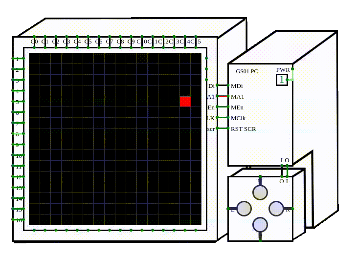
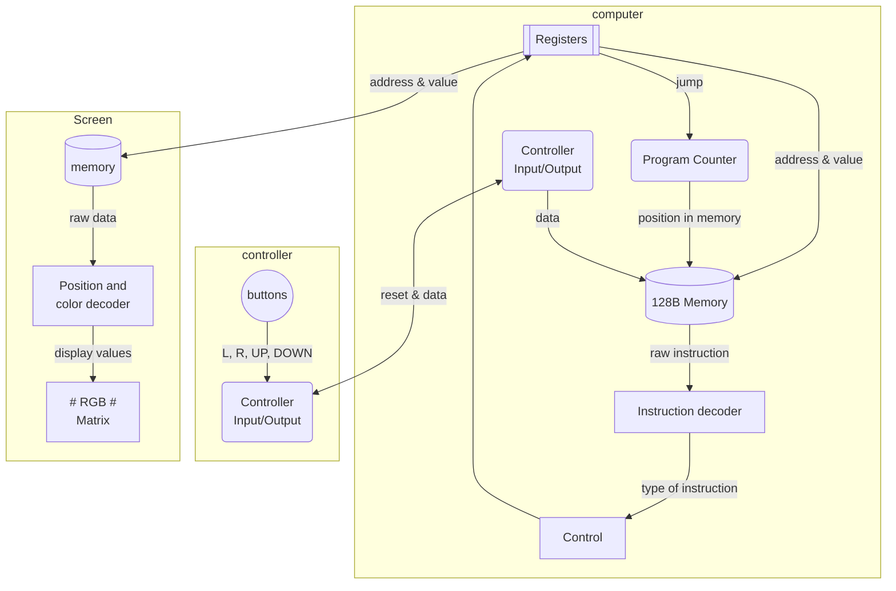

# RISC V-Architecture implementation on Circuitverse
### A limited RISC-V Computer that can control a RGB matrix - Created on CircuitVerse
Made by Glenn Corthout & Stijn Verwoerd 




## Index

* [Dataflow](##heading-2 "Goto Dataflow")
* [Instructions](##heading-3 "Instructions")
* [RGB Matrix](##heading-4 "Goto RGB Matrix")
* [Registers](##heading-5 "Registers")
* [Memory](##heading-6 "Goto Memory")
* [Controller](##heading-7 "Controller")
* [Assembly code](##heading-8 "Assembly code")


## Dataflow


## Instructions

We implemented the following instruction set:

* ADD
* ADDI
* AND
* OR
* BEG
* BEQ
* BLT
* BLTU
* SRL
* SRA
* SLL
* SW
* LW

## RGB Matrix


### Registers


To use our computer effectively and be able to program it, we will have to assign certain registers to certain tasks

controller:
* x10 - ```0x00000000``` | Here the injected controller value gets stored temporarily
* x16 - ```0x00000001``` | Represents the Left button
* x17 - ```0x00000002``` | Represents the Right button
* x18 - ```0x00000003``` | Represents the Up button
* x19 - ```0x00000004``` | Represents the Down button

Video memory:
* x15 - ```0x00000200``` | This is the starting address of video memory

## Memory

Currently the computer has total of 128 4-byte addresses with an extra 16 adresses for video memory at address 512+.
This means the computer has a grand total of 18.4kb memory.

Address ```0x000001FC``` (address 508) is being used as the memory address where the controller value gets injected.

## Assembly code

### Simple color changing routine, increase or decrease the value in row 4
```t
lw x10, 60(x0)      # load in ctrmem
blt x10, x16, -4    # if ctrmem < 1 go back to start
blt x10, x17, 8     # if ctrmem < 2 go to add -1
blt x10, x18, 20    # if ctrmem < 3 go to add +1

addi x5, x5, -1     # add -1 to x5
sw x5, 16(x15)      # store x5 in Vmem place 16
sw x0, 60(x0)       # store 0 in controller mem slot
blt x0, x17, -28    # go back to start of program

addi x5, x5, 1      # add 1 to x5
sw x5, 16(x15)      # store x5 in Vmem place 16
sw x0, 60(x0)       # store 0 in controller mem slot
blt x0, x17, -44    # go back to start of program
```

### Code that can make a pixel move up, down, left or right

```t
# start of the program
    addi x15, x0, 512       # 0         Starting address of video memory
    addi x14, x15, 28       # 4         This will be the starting /address/ of the first pixel
    addi x13, x13, 65536    # 8         This will be the starting /value/ for the first pixel
    addi x4, x0, 4          # 12
# checks if button pressed
    lw x10, 508(x0)         # 16        Load control memory into x10
    beq x10, x0, -4         # 20        If ctrmem == 0, go to start of loop
    beq x10, x16, 16        # 24        If ctrmem == 1, go to Left
    beq x10, x17, 24        # 28        If ctrmem == 2, go to Right
    beq x10, x18, 32        # 32        If ctrmem == 3, go to Up
    beq x10, x19, 56        # 36        If ctrmem == 4, go to Down
# Left    
    sll x13, x13, x4        # 40        Shift pixel left
    sw x13, 0(x14)          # 44        Save the value
    beq x0, x0, 52          # 48        jump to reset
# Right   
    srl x13, x13, x4        # 52        Shift pixel right
    sw x13, 0(x14)          # 56        save the value
    beq x0, x0, 40          # 60        jump to reset
# Up   
    addi x14, x14, -4       # 64        Add -4 to pixel address (move one row up)
    sw x0, 4(x14)           # 68        save 0 in the old row
    sw x13, 0(x14)          # 72        save the pixel value in the new row
    beq x0, x0, 24          # 76        jump to reset

# Down          
    addi x14, x14, 4        # 80        Add 4 to pixel address (move one row down)
    sw x0, -4(x14)          # 84        Save 0 in the old row
    sw x13, 0(x14)          # 88        save the pixel value in the new row
    beq x0, x0, 4           # 92        jump to reset
# reset 
    sw x0, 508(x0)          # 96        Store 0 in control memory
    beq x0, x0, -84         # 100       Jump back to start
```