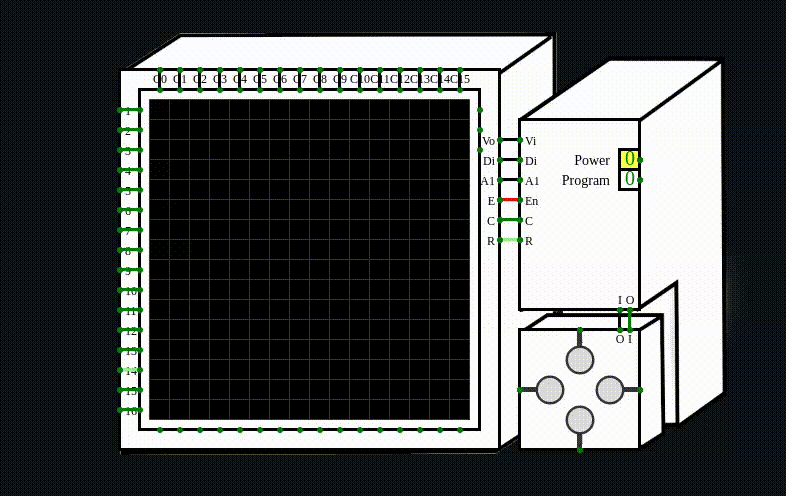
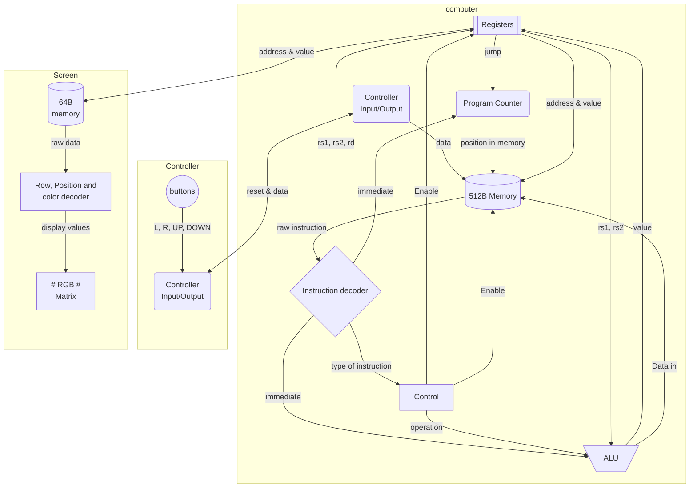
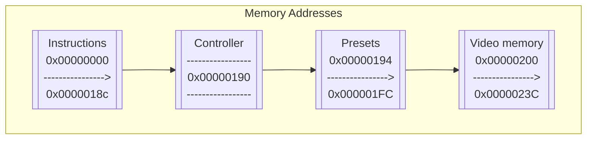

# 32-bit RISC-V Architecture implementation on Circuitverse
### Limited implementation of the RISC-V ISA that can control a RGB matrix
Made by *Glenn Corthout* & *Stijn Verwoerd* 




## Index

* [**Dataflow**](#dataflow "Goto Dataflow")
* [**Instructions**](#instructions "Goto Instructions")
* [**RGB Matrix**](#rgbmatrix "Goto RGB Matrix")
* [**Registers**](#registers "Goto Registers")
* [**Memory**](#memory "Goto Memory")
* [**Controller**](#controller "Goto Controller")
* [**Assembly code**](#assembly "Goto Assembly code")

### <a id="dataflow"></a>
## Dataflow 
*This is a simplified diagram of the circuit*

### <a id="instructions"></a>

## Instructions 

We implemented the following instruction set:

* **R-type:**   ADD, SUB, SLL, SRL, SRA, AND, OR, 
* **I-type:**   LW, ADDI, SLLI, 
* **S-type:**   SW
* **SB-type:**  BEQ, BLT, BGE, BLTU, BGEU

---

Since explaining the exact implementation of the instructions would be a boring lecture, we instead give you the values you can use to test the more abstract instructions.


#### BLTU: 
Compares two registers as unsigned integers. 

If the value in the first register is less than the value in the seocnd register, it branches to the specified label; 
otherwise, it continues to the next instruction.

    Test this instruction with the following entry's:
    * instruction: `0x0030e463`
    * x1: `0x00000001`
    * x3: `0xffffffff`

`0xffffffff` is -1 signed, but 4.294.967.295 unsigned. Hence for this instruction x3 will be larger than x1 and a jump will happen.

#### BGE:
Compares two registers as signed integers. 
    
If the value in the first register is greater than or equal ot the value in the second register, it branches to the specified label;
otherwise, it continues to the next instruction.

    Test this instruction with the following entry's:
    * instruction: `0x0030d463`
    * x1: `0x00000001`
    * x3: `0xffffffff`

`0xffffffff` is -1 (signed). Hence for this instruction x1 will be larger than x3 and a jump will happen.

#### **BGEU**:
Compares two registers as unsigned integers. 
    
If the value in the first register is greater than or equal to the value in the second registers, it branches to the specified label;
otherwise, it continues to the next instruction.
  
    Test this instruction with the following entry's:
    * instruction: `0x0030f463`
    * x1: `0xffffffff`
    * x3: `0x00000001`

`0xffffffff` is -1 signed, but 4.294.967.295 unsigned. Hence for this instruction x1 will be larger than x3 and a jump will happen.

#### BEQ:
Compares two registers. 
    
If the values in the two registers are equal, it branches to the the specified label;
otherwise, it continues to the next instruction.
  
    Test this instruction with the following entry's:
    * instruction: `0x00308463`
    * x1: `0x00000000`
    * x3: `0x00000000`

Since registers x1 and x3 are the same, a jump will happen to the specified label.

#### SRL: 
Performs a **logical** right shift on a value in a register. 
It shifts the bits in the first register right by the number of positions specified in the second register,
filling the leftmost bits with zeros, and stores the result in the destination register.

#### SRA:
Performs an **arithmetic** right shift on a value in a register. 
It shifts the bits in the first register right by the number of positions specified in the second register,
preserving the sign bit, and stores the result in the destination register

#### SUB:
Subtracts the value in the second register from the value in the first register and stores the result in the destination register.

#### SLL:
Performs a **logical** left shift on a value in a register. 
It shifts the bits in the first register left by the number of positions specified in the second register,
filling the rightmost bits with zeros, and stores the result in the destination register.

#### SLLI:
Performs a **logical** left shift on a value in a register. 
It shifts the bits in the first register left by an immediate value (specifiP 
filling the rightmost bits with zeros, and stores the result in the destination register.

#### AND:
Performs a bitwise AND operation between two registers. 
It stores the result in the destination register, where each bit is set to 1 if both corresponding bits in the input
registers are 1, and 0 otherwise.

#### OR:
Performs a bitwise OR operation between two registers. 
It stores the result in the destination register, where each bit is set to 1 if at least one of the corresponding bits 
in the input registers is 1, and 0 otherwise.

### <a id="rgbmatrix"></a>

## RGB Matrix 
We use a 16x16 RGB matrix that is supplied by CircuitVerse.

The matrix can be driven by inserting a value into the address range 0x00000200 - 0x0000023c (vram). Every 4 bytes represents 1 row of the screen 
and uses a simple protocol for the data. The data is structured as follows, imagine a 32 bit string divided into 16 2-bit 'cells' that each
tell something about the location and the color assigned to it.

`00000001000000110000000010000000`

| 1  | 2  | 3  | 4  | 5  | 6  | 7  | 8  | 9  | 10 | 11 | 12 | 13 | 14 | 15 | 16 |
|----|----|----|----|----|----|----|----|----|----|----|----|----|----|----|----|
| 00 | 00 | 00 | 01 | 00 | 00 | 00 | 11 | 00 | 00 | 00 | 00 | 10 | 00 | 00 | 00 |

In this case pixels 4,8 & 13 would be turned on and 
we defined the colors as such:
* `00` - Black
* `01` - Red
* `10` - Green
* `11` - Blue

Each of these colors is then encoded into their respective 24 bit value that the matrix takes as an input for color.

* `111111110000000000000000` - Red
* `000000001111111100000000` - Green
* `000000000000000011111111` - Blue

To select a row the address value gets decoded by doing a bitshift of 2 positions to the right (effectively dividing it by 4) and then is used as an input for the decoder that selects the row. This way the same value will be placed in memory and will be directly displayed on the matrix. With a faster CPU this would be an incorrect implementation and you would instead fill the framebuffer before rendering it, this method however allows us to display the changes significantly faster.

Let's say we want to set pixel 16 on row 3 to the colour blue, we would use the following instructions:
```t
addi x4, x0, 3                  # sets the register x4 to the value you have stored in memory
sw x4, 524(x0)                  # stores the value in x4 to the 3th row in the video memory
```
To pull up a value from memory into the video memory you would do the following:
```t
lw x4, /youraddressvaluehere/   # sets the register x4 to the value you have stored in memory
sw x4, 12(x15)                  # stores the value in x4 to the 3th row in the video memory
```

### <a id="registers"></a>

## Registers

Certain values we insert into the register module to save extra lines of code, these are standard values for every program.

controller:
* x10 - ```0x00000000``` | Here the injected controller value gets stored temporarily
* x16 - ```0x00000001``` | Represents the Left button
* x17 - ```0x00000002``` | Represents the Right button
* x18 - ```0x00000003``` | Represents the Up button
* x19 - ```0x00000004``` | Represents the Down button

Video memory:
* x15 - ```0x00000200``` | This is the starting address of video memory

### <a id="memory"></a>

## Memory 

Currently the computer has total of 128 4-byte addresses with an extra 16 adresses for video memory at address 512-572. The video memory is not normally accessible through the program counter or part of the normal memory, and can only be accessed directly by means of reading and writing to it.



### Video Memory

To overcome CircuitVerse limitations of a 20hz clock, we have decided to offload the framebuffer immediately to render each changing row of the screen as soon as it goes in, otherwise the waiting in between each full frame would be too long.  

### <a id="controller"></a>

## Controller 

We use a standard address for the controller.

Address ```0x00000190``` (byte address 400) is being used as the memory address where the controller value gets injected.

The controller is made functional by a circuit that de-couples the clock from the rest of the circuit and injects a value straight into
memory position 0x00000190 when a button press is detected. The button pressed are buffered and are reset immediately after the injection, then the software has to detect the button press and can wipe the value from memory so that a new value an be inserted.

### <a id="assembly"></a>

## Assembly code 


All the code was assembled into machine code with [**THIS**](https://github.com/StijnVerwoerd/RISC-V-Assembler) simple assembler.

### Maze game

The following game is a very incomplete (it has no rules beyong a starting position and a final finish position) maze game, in which you can control a dot to walk through a predetermined maze. There is nothing stopping you from clipping straight through the walls or walking outside of the boundaries of the screen.

Maze program:
```t
# beginning of screen
    addi x15, x0, 512               # beginning of screen
# maze letters
    lw x31, 472(x0)     #row 5
    sw x31, 16(x15)
    lw x31, 476(x0)     #row 6
    sw x31, 20(x15)
    lw x31, 480(x0)     #row 7
    sw x31, 24(x15)
    lw x31, 484(x0)     #row 8
    sw x31, 28(x15)
    lw x31, 488(x0)     #row 9
    sw x31, 32(x15)
# wait 2 seconds
    addi x2, x0, 20
    addi x1, x1, 1
    blt x1, x2, -8
# values
    addi x5, x15, 64                # set end of screen + 4
    addi x6, x0, 408                # set beginning of maze place in memory
    addi x4, x0, 2                  # steps for bitshift
    lw x3, 404(x0)                  # load up the number that equals end of maze into x3
# load up maze
    add x7, x0, x6                  # start of maze in mem
    add x23, x0, x15                # add the start row of screen memory to x23
    lw x31, 0(x7)                   # load maze value into x31
    sw x31, 0(x23)                  # store maze value on row x23
    addi x23, x23, 4                # make x23 the next row
    addi x7, x7, 4                  # next value in memory of the maze
    blt x23, x5, -16                # if current row is smaller than last row of the screen, go back to load the next value
# load up player position
    lw x21, 60(x15)                 # load current row
    addi x22, x0, 4                # pos x
    add x21, x21, x22               # add pixel to row value
    addi x23, x15, 60               # pos y
    sw x21, 0(x23)                  # render pixel on screen
# button pressed loop 
    lw x10, 400(x0)                 # Load control memory into x10
    beq x10, x0, -4                 # If ctrmem == 0, go to start of loop
    beq x10, x16, 16                # If ctrmem == 1, go to Left
    beq x10, x17, 36                # If ctrmem == 2, go to Right
    beq x10, x18, 56                # If ctrmem == 4, go to Up
    beq x10, x19, 84                # If ctrmem == 8, go to Down
# left
    lw x27, 0(x23)                  # loads current value into reg x27
    sub x27, x27, x22               # subtracts current position from x27 
    sll x22, x22, x4                # shift the value of the player position 2 bits to the left
    add x27, x27, x22               # add the value of the position and the row together
    sw x27, 0(x23)                  # store the value in the current row
    beq x0, x0, 88                  # jump to reset
# right
    lw x27, 0(x23)                  # loads current value into reg x27
    sub x27, x27, x22               # subtracts current position from x27 
    srl x22, x22, x4                # shift the value of the player position 2 bits to the right
    add x27, x27, x22               # add the value of the position and the row together
    sw x27, 0(x23)                  # store the value in the current row
    beq x0, x0, 64                  # jump to reset
# up
    lw x27, 0(x23)                  # loads current row value into register x27
    sub x27, x27, x22               # subtracts postion x from the current row value
    addi x23, x23, -4               # moves pos y one row up
    lw x21, 0(x23)                  # loads in new row into x21
    add x21, x21, x22               # adds postition x into x21
    sw x27, 4(x23)                  # stores the removed pos x back into vmem
    sw x21, 0(x23)                  # stores the added pos x back into vmem
    beq x0, x0, 32                  # jump to reset
# down
    lw x27, 0(x23)                  # loads current row value into register x27
    sub x27, x27, x22               # subtracts postion x from the current row value
    addi x23, x23, 4                # moves pos y one row down
    lw x21, 0(x23)                  # loads in new row into x21
    add x21, x21, x22               # adds postition x into x21
    sw x27, -4(x23)                 # stores the removed pos x back into vmem
    sw x21, 0(x23)                  # stores the added pos x back into vmem
# reset
    beq x21, x3, 12                 # jump to reset screen
    sw x0, 400(x0)                  # Store 0 in control memory
    beq x0, x0, -140                # Jump back to start
# reset screen
    add x23, x0, x15                # add the start row of screen memory to x23
    sw x0, 0(x23)                   # make the screen black on row x23
    addi x23, x23, 4                # make x23 the next row
    blt x23, x5, -8                 # if current row is smaller than last row of the screen, go back to reset screen
# finish
    lw x31, 492(x0)     #row 5
    sw x31, 16(x15)
    lw x31, 496(x0)     #row 6
    sw x31, 20(x15)
    lw x31, 500(x0)     #row 7
    sw x31, 24(x15)
    lw x31, 504(x0)     #row 8
    sw x31, 28(x15)
    lw x31, 508(x0)     #row 9
    sw x31, 32(x15)
    beq x0, x0, -56                 # jump back to reset screen
```

Place all the maze values directly into memory to be able to load up the game

The following values are in hexadecimal, they go from left to right, inserted in memory up to down (smaller to higher value) in the preset part of memory.

'MAZE' text:
```
20256A54 
28A44240 
22254850 
20246040 
20246A54
```
Maze:
```
8AAAAAAA
80020802
8AA08222
A0082022
82220A82
88202022
88828202
880828A2
88A08002
82220AA2
A0222002
8A202222
8022220A
8A882282
80008022
AAAAAAA2
```
End of Maze value:
```
9AAAAAAA
```
'WIN!' text:
```
101230C4 
10103CC4 
111233C4 
145230C0 
101230C4
```
