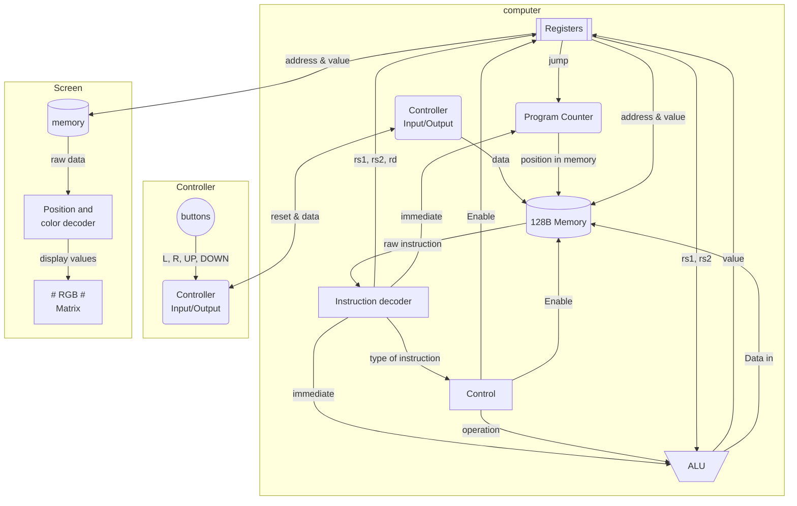

# RISC V-Architecture implementation on Circuitverse
### A limited RISC-V Computer that can control a RGB matrix - Created on CircuitVerse
Made by Glenn Corthout & Stijn Verwoerd 


## Index

* [Dataflow](#dataflow "Goto Dataflow")
* [Instructions](#instructions "Goto Instructions")
* [RGB Matrix](#rgbmatrix "Goto RGB Matrix")
* [Registers](#registers "Goto Registers")
* [Memory](#memory "Goto Memory")
* [Controller](#controller "Goto Controller")
* [Assembly code](#assembly "Goto Assembly code")

### <a id="dataflow"></a>
## Dataflow 

### <a id="instructions"></a>

## Instructions 

We implemented the following instruction set:


* ADD
* ADDI
* AND
* OR
* BEG
* BEQ
* BLT
* BLTU
* SRL
* SRA
* SLL
* SW
* LW

### <a id="rgbmatrix"></a>

## RGB Matrix 
We use a 16x16 RGB matrix that is supplied by CircuitVerse.

The matrix can be driven by inserting a value into the address range 0x00000200 - 0x0000023c. Every 4 bytes represents 1 row of the screen 
and uses a simple protocol for the data. The data is structured as follows, imagine a 32 bit string divided into 16 2-bit 'cells' that each
tell something about the location and the color assigned to it.

`00000001000000110000000010000000`

| 1  | 2  | 3  | 4  | 5  | 6  | 7  | 8  | 9  | 10 | 11 | 12 | 13 | 14 | 15 | 16 |
|----|----|----|----|----|----|----|----|----|----|----|----|----|----|----|----|
| 00 | 00 | 00 | 01 | 00 | 00 | 00 | 11 | 00 | 00 | 00 | 00 | 10 | 00 | 00 | 00 |

In this case pixels 4,8 & 13 would be turned on and 
we defined the colors as such:
* `00` - Black
* `01` - Red
* `10` - Green
* `11` - Blue

each of these colors is then encoded into their respective 24 bit value that the matrix takes as an input for color.

* `111111110000000000000000` - Red
* `000000001111111100000000` - Green
* `000000000000000011111111` - Blue

To cycle through the rows that should be inserted we have created a small program counter that counts 4 at a time (to jump 4 bytes in memory) and that also splits off and decodes into a row selector for the matrix, this way the same row and value in memory are selected simultaneously. 

Let's say we want to set pixel 2 on row 3 to the colour blue, we would use the following instructions:
```t
addi x4, x0, 805306368      # sets the register x4 to the value 00110000000000000000000000000000
sw x4, 12(x15)              # stores the value in x4 to the 3th row in the screen memory
```

### <a id="registers"></a>

## Registers

To use our computer effectively and be able to program it, we will have to assign certain registers to certain tasks

controller:
* x10 - ```0x00000000``` | Here the injected controller value gets stored temporarily
* x16 - ```0x00000001``` | Represents the Left button
* x17 - ```0x00000002``` | Represents the Right button
* x18 - ```0x00000003``` | Represents the Up button
* x19 - ```0x00000004``` | Represents the Down button

Video memory:
* x15 - ```0x00000200``` | This is the starting address of video memory

### <a id="memory"></a>

## Memory 

Currently the computer has total of 128 4-byte addresses with an extra 16 adresses for video memory at address 512+.
This means the computer has a grand total of 18.4kb memory.

Address ```0x000001FC``` (address 508) is being used as the memory address where the controller value gets injected.


### <a id="controller"></a>

## Controller 


### <a id="assembly"></a>

## Assembly code 

### Simple color changing routine, increase or decrease the value in row 4
```t
lw x10, 60(x0)      # load in ctrmem
blt x10, x16, -4    # if ctrmem < 1 go back to start
blt x10, x17, 8     # if ctrmem < 2 go to add -1
blt x10, x18, 20    # if ctrmem < 3 go to add +1

addi x5, x5, -1     # add -1 to x5
sw x5, 16(x15)      # store x5 in Vmem place 16
sw x0, 60(x0)       # store 0 in controller mem slot
blt x0, x17, -28    # go back to start of program

addi x5, x5, 1      # add 1 to x5
sw x5, 16(x15)      # store x5 in Vmem place 16
sw x0, 60(x0)       # store 0 in controller mem slot
blt x0, x17, -44    # go back to start of program
```

### Code that can make a pixel move up, down, left or right

```t
# start of the program
    addi x15, x0, 512       # 0         Starting address of video memory
    addi x14, x15, 28       # 4         This will be the starting /address/ of the first pixel
    addi x13, x13, 65536    # 8         This will be the starting /value/ for the first pixel
    addi x4, x0, 4          # 12
# checks if button pressed
    lw x10, 508(x0)         # 16        Load control memory into x10
    beq x10, x0, -4         # 20        If ctrmem == 0, go to start of loop
    beq x10, x16, 16        # 24        If ctrmem == 1, go to Left
    beq x10, x17, 24        # 28        If ctrmem == 2, go to Right
    beq x10, x18, 32        # 32        If ctrmem == 3, go to Up
    beq x10, x19, 56        # 36        If ctrmem == 4, go to Down
# Left    
    sll x13, x13, x4        # 40        Shift pixel left
    sw x13, 0(x14)          # 44        Save the value
    beq x0, x0, 52          # 48        jump to reset
# Right   
    srl x13, x13, x4        # 52        Shift pixel right
    sw x13, 0(x14)          # 56        save the value
    beq x0, x0, 40          # 60        jump to reset
# Up   
    addi x14, x14, -4       # 64        Add -4 to pixel address (move one row up)
    sw x0, 4(x14)           # 68        save 0 in the old row
    sw x13, 0(x14)          # 72        save the pixel value in the new row
    beq x0, x0, 24          # 76        jump to reset

# Down          
    addi x14, x14, 4        # 80        Add 4 to pixel address (move one row down)
    sw x0, -4(x14)          # 84        Save 0 in the old row
    sw x13, 0(x14)          # 88        save the pixel value in the new row
    beq x0, x0, 4           # 92        jump to reset
# reset 
    sw x0, 508(x0)          # 96        Store 0 in control memory
    beq x0, x0, -84         # 100       Jump back to start
```